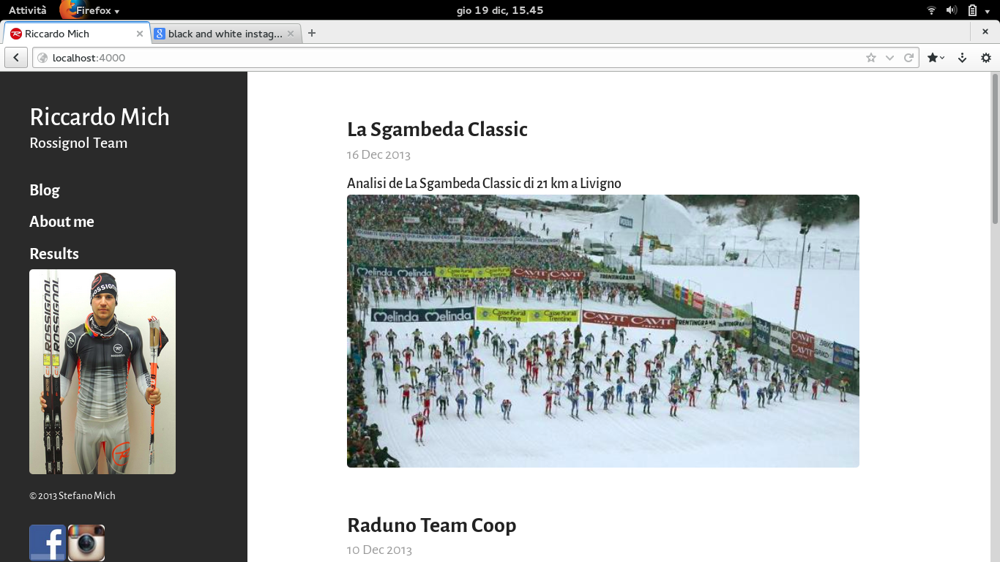

# [riccardomich.com](http://riccardomich.com)

Website that uses the Hyde theme.
An elegant open source, mobile-first theme for [Jekyll](https://github.com/mojombo/jekyll). It includes lightweight styles and placeholder content to get you up and running with a simple blog in no time.

Open sourced under the [MIT license](LICENSE.md).

<3
